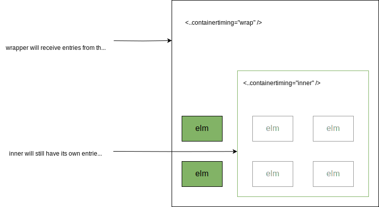

# Container Timing: Explainer

## Authors

- Jason Williams (Bloomberg)
- José Dapena Paz (Igalia)

## Participate

- [Explainer Issues](https://github.com/bloomberg/container-timing/issues)
- [Github Repo](https://github.com/bloomberg/container-timing)

## Table Of Contents

1. [Authors](#authors)
1. [Introduction](#introduction)
1. [Motivation](#motivation)
1. [Objectives](#objectives)
1. [Registration](#registration)
1. [PerformanceContainerTiming](#performancecontainertiming)
   1. [Web IDL (subject to change)](#web-idl-subject-to-change)
1. [Algorithm](#algorithm)
   1. [Life Cycle](#life-cycle)
1. [Nested Containers Roots](#nested-container-roots)
   1. [Ignore](#ignore-default)
   1. [Transparent](#transparent)
   1. [Shadowed](#shadowed)
1. [Non Goals](#non-goals)
   1. [LCP Integration](#lcp-integration)
   1. [Built-in containers](#built-in-containers)
   1. [Shadow DOM](#shadow-dom)
1. [Security and Privacy](#security-and-privacy)
1. [Polyfill](#polyfill)
1. [Considered alternatives](#considered-alternatives)
1. [Questions](#questions)
1. [Implementation](#implementation-work)
1. [Browser extension](#extension)
1. [Glossary](#glossary)
1. [Links](#links--further-reading)

## Introduction

The Container Timing API enables monitoring when annotated sections of the DOM are displayed on screen and have finished their initial paint.
A developer will have the ability to mark subsections of the DOM with the `containertiming` attribute (similar to `elementtiming` for the [Element Timing API](https://developer.mozilla.org/en-US/docs/Web/API/PerformanceElementTiming)) and receive performance entries when that section has been painted for the first time. This API will allow developers to measure the timing of various components in their pages.

Unlike with Element Timing it is not possible for the renderer to know when a section of the DOM has finished painting (there could be future changes, asynchronous requests for new images, slow loading buttons etc), so this API will offer candidates in the form of new [`PerformanceEntry`](https://developer.mozilla.org/en-US/docs/Web/API/PerformanceEntry) objects when there has been an update, and the developer can choose to take the most recent entry or stop recording when there has been user interaction.

## Motivation

As developers increasingly organise their applications into components there's becoming a demand to measure performance on subsections of an application or a web page. For instance, [a developer may want to know](https://groups.google.com/g/web-vitals-feedback/c/TaQm0qq_kjs/m/z1AGXE0MBQAJ?utm_medium=email&utm_source=footer) when a subsection of the DOM has been painted, like a table or a widget, so they can mark the paint time and submit it to their analytics.

Current Web APIs don't help with this. Element Timing is [limited](https://w3c.github.io/paint-timing/#timing-eligible) due to what it can mark so it can't be used for whole sections. The polyfill referenced below does attempt to provide a userspace solution by adding Element Timing to all elements within a container and using the data from those performance entries to know when painting has finished. This does have several drawbacks though:

- Marking elements with the `elementtiming` attribute needs to happen as early as possible before painting happens; this will require server side changes or blocking rendering until all elements are marked (degrading performance)
- A [MutationObserver](https://developer.mozilla.org/en-US/docs/Web/API/MutationObserver) needs to be utilised to catch new elements being injected into the DOM (with `elementtiming` being set)
- The polyfill will need to run and perform set up in the head of the page increasing the time to first paint
- Tracking of rectangles will need to be performed in userspace rather then the browsers built in 2D engine making it much less efficient

Developers know their domain better than anyone else and they would like to be able to communicate the performance of their own blocks of content in a way that their users or organisation would understand, for example ["time to first tweet"](https://youtu.be/1jGaov-4ZcQ?si=lwk3mIRuwvxxWCDQ&t=2907).

Being able to mark a segment of content and asking the render to identify when that has been painted is a growing request by developers.

## Goals

1. Inform developers when sections of the DOM are first displayed on the screen. To keep the first version of this spec simpler, we are not including shadow DOM in this version, as this still needs to be understood for `elementtiming`.
2. Inform developers when those same sections of the DOM have finished their initial paint activity (indicating this section is ready for viewing or interacting with).

## Non Goals

### LCP Integration

This is not intended to provide changes to the [Largest Contentful Paint](https://developer.mozilla.org/en-US/docs/Web/API/LargestContentfulPaint) algorithm. Although in the future LCP could benefit from user-marks of content which are containers and receiving paint times from those to choose better candidates it's currently not in scope whether this will have any affect any on any existing browser metrics.

### Built-in containers

The changes here are also not going to add support to built in composite elements such as MathML or SVG. In future it's possible for a follow up proposal to mark those elements as containers so they can be counted for higher-level metrics such as LCP and added to the results when observing container timing.

### Shadow DOM

Currently Element Timing [doesn't have support for shadow DOM](https://github.com/WICG/element-timing/issues/3). There will need to be many architecture-decisions made on how the shadow DOM interacts with element timing, (should it be opened up or closed, should individual elements be surfaced or just the shadow host element). Once we have a good story for Element Timing we can later have a proposal for Container Timing too (which hopefully follows similar rules to the Element Timing API).

## Using the API

As with [Element Timing](https://github.com/WICG/element-timing), registration will be on a per-element basis. An element with a `containertiming` attribute will have itself and its whole sub-tree registered for container timing. There is currently no plan for implicit registration; see [Built-in containers](#built-in-containers).

Example:

```html
<div … containertiming="foobar"></div>
...
<script>
  const observer = new PerformanceObserver((list) => {
    let perfEntries = list.getEntries();
    // Process the entries by iterating over them.
  });
  observer.observe({ entryTypes: ["container"] });
</script>
```

It is strongly encouraged to set the attribute before the element is added to the document (in HTML, or if set in JavaScript, before adding it to the document). Setting the attribute retroactively will only give you subsequent events and any future paints which haven't happened yet.

This is the preferred method of annotating container roots, as it gives developers the power to decide which elements they consider important.

### PerformanceContainerTiming

Now we describe precisely what information is exposed via the WebPerf API. The PerformanceContainerTiming IDL attributes are defined as followed:

- `entryType`: `"container"`
- `startTime`: A [DOMHighResTimeStamp](https://developer.mozilla.org/en-US/docs/Web/API/DOMHighResTimeStamp) of the latest container paint time
- `identifier`: The value of the element's containertiming attribute (empty string if it does not have it)
- `intersectionRect`: The bounding box of all paints accumulated so far within this container
- `size`: The size of the combined region painted (so far) within this container
- `firstRenderTime`: A [DOMHighResTimeStamp](https://developer.mozilla.org/en-US/docs/Web/API/DOMHighResTimeStamp) of the first paint time for this container
- `duration`: A [DOMHighResTimeStamp](https://developer.mozilla.org/en-US/docs/Web/API/DOMHighResTimeStamp) set to 0
- `lastPaintedElement`: An [Element](https://dom.spec.whatwg.org/#concept-element) set to the last painted element (this may need to be a set of elements painted)

### Ignoring parts of the DOM

If you want wish to ignore parts of the DOM tree you are monitoring, you can add the `containertiming-ignore` attribute to the element you want to ignore (plus its children).

```html
<div … containertiming="foobar">
  <main>...</main>
  <!-- We don't want to track paint udpates in the aside -->
  <aside containertiming-ignore>...</aside>
</div>
```

_TODO: needs adding to the polyfill_

### Web IDL (subject to change)

```idl
interface PerformanceContainerTiming: PerformanceEntry {
  readonly attribute DOMString entryType;
  readonly attribute DOMString name;
  readonly attribute DOMHighResTimeStamp? startTime;
  readonly attribute DOMString identifier
  readonly attribute DOMRectReadOnly intersectionRect;
  readonly attribute DOMHighResTimeStamp? duration;
  readonly attribute DOMHighResTimeStamp? firstRenderTime;
  readonly attribute unsigned long long size;
  readonly attribute Element? lastPaintedElement;
};
```

## Algorithm

If the Container Timing algorithm receives paint updates from elements inside a container root it will perform the following steps:

1. Set **PaintedRegionUpdated** \= false
2. Set **RenderTime** to currentPaintUpdate.renderTime
3. Set **firstRenderTime** \= containerRoot.firstRenderTime || **RenderTime**
4. Set containerRoot.firstRenderTime ??= **firstRenderTime**
5. Load the PaintedRegion associated with this container root or create a new one.
6. For each new rect that was painted perform the follows:
   1. If the PaintedRegion already contains the rect continue
   2. If the PaintedRegion does not fully contain the rect
      1. Set **PaintedRegionUpdated** to true
      2. Set **PaintedRegion** \= PaintedRegion.union(rect)
      3. Set **LastPaintedElement** \= Element the rect was associated with
      4. Set LargestElement \= containerRoot.largestElement \> Element the rect was associated with ? containerRoot.largestElement : Element
7. Create a PerformanceContainerTiming object |entry| with the following values:
   1. entryType: “container”
   2. name: ""
   3. startTime: Set to **renderTime**
   4. duration: Set to 0 (We may want to change this, see [Questions](#heading=h.elcf4k4aph14) below.
   5. identifier: This is the "containertiming" attribute value from the containerRoot
   6. firstRenderTime: Set to **firstRenderTime**
   7. size: This is **PaintedRegion**.size(), representing the painted portion of the container. This is similar to the size property in LargestContentfulPaint entries
   8. lastPaintedElement: **LastPaintedElement** This is the last element that received a paint update, this allows developers to debug what caused a paint in a container.
   9. intersectionRect: **PaintedRegion**'s rect
8. [Queue](https://w3c.github.io/performance-timeline/#queue-a-performanceentry) the entry so that relevant PerformanceObservers are notified. The entry will not be added to the performance timeline buffer

### Life Cycle

<picture>
  <source media="(prefers-color-scheme: dark)" srcset="./docs/img/life-cycle-dark.svg">
  <source media="(prefers-color-scheme: light)" srcset="./docs/img/life-cycle-light.svg">
  
</picture>

## Nested Container Roots

Nesting behaviour needs to be considered. For now we have 3 options, and we may be able to offer the developer all 3 options or we will trim this down as this proposal is developed.

In the initial implementation we provide the attribute `containertiming-nesting` that accepts as a parameter the values of the different policies: `ignore` (the default), `transparent` and `shadowed`. The attribute is meaningful only on container timing roots. It defines how events from descendant container roots will be used in the parent container root.

### Ignore (default)

The simplest option is to just ignore any content within an inner container. Developers may want this because once you hit an annotated boundary it will be of another concern, the developer may only want to measure the performance of their own content and not what is coming from something else. We may also want to add some ways for developers to just ignore content in general (such as ads which are out of the developer's control, see [Questions](#heading=h.elcf4k4aph14)). See below for a visual example.

<picture>
  <source media="(prefers-color-scheme: dark)" srcset="./docs/img/nested-ignore-dark.svg">
  <source media="(prefers-color-scheme: light)" srcset="./docs/img/nested-ignore-light.svg">
  
</picture>

### Transparent

This option ignores boundaries and assumes all elements below the container timing root are to be measured, this may be useful for developers who want to measure much larger parts of their UI (but still want to keep track of smaller components).

<picture>
  <source media="(prefers-color-scheme: dark)" srcset="./docs/img/nested-transparent-dark.svg">
  <source media="(prefers-color-scheme: light)" srcset="./docs/img/nested-transparent-light.svg">
  
</picture>

### Shadowed

Shadowed has the same concern as "transparent" (measuring everything below the `containertiming` root), except it will only receive the dimensions and references to the root container timing element itself. This mode would be future compatible for Shadow DOM elements if they are to be supported.

<picture>
  <source media="(prefers-color-scheme: dark)" srcset="./docs/img/nested-shadowed-dark.svg">
  <source media="(prefers-color-scheme: light)" srcset="./docs/img/nested-shadowed-light.svg">
  
</picture>

## Security and Privacy

The cross-frame boundary is not breached: elements belonging to iframes are not exposed to the parent frames. No timing information is passed to the parent frame unless the developer themselves explicitly pass information via postMessage.

Most of the information provided by this API can already be estimated, even if in tedious ways. Element Timing returns the first rendering time for images and text. The PaintTiming API could be used to compute a related timestamp for all the elements within a container root (see [Polyfill](#heading=h.3wxxpyowvuit)).

## Polyfill

- See [Polyfill](./docs/polyfill.md)
- See [Polyfill Performance Impact](./docs/performance-impact.md)

## Considered alternatives

### Element Timing everywhere

Element Timing can be applied to any element by the developer, but is too limited in what it can support. Developers wanting to measure when a component is ready would need to apply the attribute to every element which is cumbersome and sometimes infeasible (when the component is not authored by them). On top of this, element timing wouldn't take into account new elements coming into the DOM at a later stage.

### Largest Contentful Paint

For the reasons mentioned in the [Motivation](#motivation), Largest Contentful Paint (LCP) isn't useful enough to time when specific parts of the page have loaded, it utilizes element timing for its functionality and thus has the same shortcomings as element timing.

### User-space polyfill in JavaScript

As mentioned in the [Motivation](#motivation) the polyfill would need a few things in place to work properly and can add overhead to the web application.
The polyfill will need to mark elements with `elementtiming` as soon as possible, especially before the browser begins painting. In order to achieve this the polyfill will need to run in the head, block rendering and scan the DOM for a `containertiming` attribute and modify the children elements to add the `elementtiming` attributes to all "eligible" child nodes.

After marking elements in the initial DOM the polyfill will then need to setup a MutationObserver to watch for changes in the tree and tag newly-incoming elements with the `elementtiming` attribute before they are painted. This can lead to a race condition where the element may paint before the attribute is applied and element timing is taken into effect.

Finally tracking of all rectangles in user space may not be as efficient as the browsers built-in 2D library and thus can incur memory overhead.

## Questions

- Setting the `containertiming` attribute far up the tree could cause a lot of processing as the depth is infinite, we may need to have some limit or default depth set.
- ~~We will want to add some way for developers to ignore certain blocks of elements without using an inner container (which would degrade performance).~~
- As most developers will be using this for startup metrics (similar to LCP) do we want to offer an option to stop tracking on user input?
- Do we want to populate the duration field in the `ContainerTimingPerformance` object, currently it's 0. There is an argument for it being `RenderTime - TimeOrigin`, but the `renderTime` already represents that value. So it could be `RenderTime - StartTime` so you can see the delta between the first render time and the current one.
- As the browser paints in batches lastPaintedElement may need to be an array of elements
- Should `containertiming-nesting` actually reflect how propagation goes to ancestors, instead of how it processes descendants?
- What if we move from `containertiming-ignore` and `containertiming-nesting` to a single attribute that reflects how propagation upwards works, that can be set at any node, and not only in container roots? The `ignore` value would work as both `ignore` in nesting and `containertiming-ignore`. And `shadowed` would be used to explicitely hide implementation details. Should this value be different depending on the different element types?

## Implementation Work

- [https://chromium-review.googlesource.com/c/chromium/src/+/6268795](https://chromium-review.googlesource.com/c/chromium/src/+/6268795)
- [https://chromium-review.googlesource.com/c/chromium/src/+/5713794](https://chromium-review.googlesource.com/c/chromium/src/+/5713794)
- [https://chromium-review.googlesource.com/c/chromium/src/+/6268796](https://chromium-review.googlesource.com/c/chromium/src/+/6268796)
- [https://chromium-review.googlesource.com/c/chromium/src/+/6268797](https://chromium-review.googlesource.com/c/chromium/src/+/6268797)
- [https://chromium-review.googlesource.com/c/chromium/src/+/6268798](https://chromium-review.googlesource.com/c/chromium/src/+/6268798)
- [https://chromium-review.googlesource.com/c/chromium/src/+/6270776](https://chromium-review.googlesource.com/c/chromium/src/+/6270776)
- [https://chromium-review.googlesource.com/c/chromium/src/+/6533016](https://chromium-review.googlesource.com/c/chromium/src/+/6533016)
- [https://chromium-review.googlesource.com/c/chromium/src/+/6533017](https://chromium-review.googlesource.com/c/chromium/src/+/6533017)
- [https://chromium-review.googlesource.com/c/chromium/src/+/6270777](https://chromium-review.googlesource.com/c/chromium/src/+/6270777)

## Browser Extension

You can try out the Chrome extension [here](https://github.com/jdapena/container-timing-extension). You will need to build it manually for now and load the browser with it set as an argument.

## Glossary

- **Region**: This is an object which efficiently holds Rects and can calculate overlaps between them plus various other things such as total size etc. In Chromium this would be a [Skia](https://skia.org/) or [SkRegion](https://api.skia.org/classSkRegion.html), Firefox's Moz2D and Webkit's CoreGraphics libraries should have equivalent concepts.
- **Container Root**: This is an element which has the "containertiming" attribute applied

## Links & Further Reading

- [https://tag.w3.org/explainers/](https://tag.w3.org/explainers/)
- [Pushing Pixels | Mark Zeman | performance.now() 2023](https://www.youtube.com/watch?t=2907&v=1jGaov-4ZcQ&feature=youtu.be)
- Element Timing For Containers: [https://www.youtube.com/watch?v=MjGVtshDN7U](https://www.youtube.com/watch?v=MjGVtshDN7U).
- [Element Timing for Text](https://docs.google.com/document/d/1xhPJnXf0Nqsi8cBFrlzBuHavirOVZBd8TqdD_OyrDGw/edit)
- [Element Timing Implementation Proposal](https://docs.google.com/document/d/1BvHknbj3T-fUuj4RxHF8qGRNxbswtBqUjKiPx7iLXCc/edit#heading=h.sgo0q1rfaa9b)

## References & acknowledgements

Many thanks for valuable feedback and advice from:

- [Barry Pollard](https://github.com/tunetheweb)
- [Michael Mocny](https://github.com/mmocny)
- [Scott Haseley](https://github.com/shaseley)
- [Sergey Chernyshev](https://github.com/sergeychernyshev)
