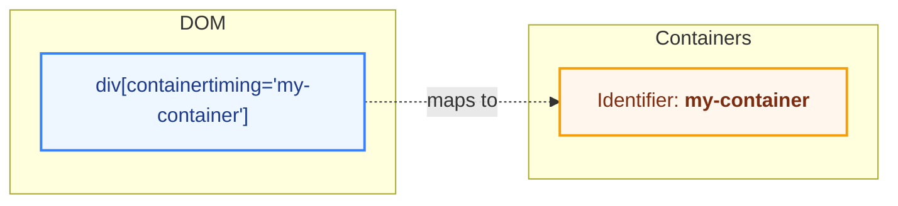
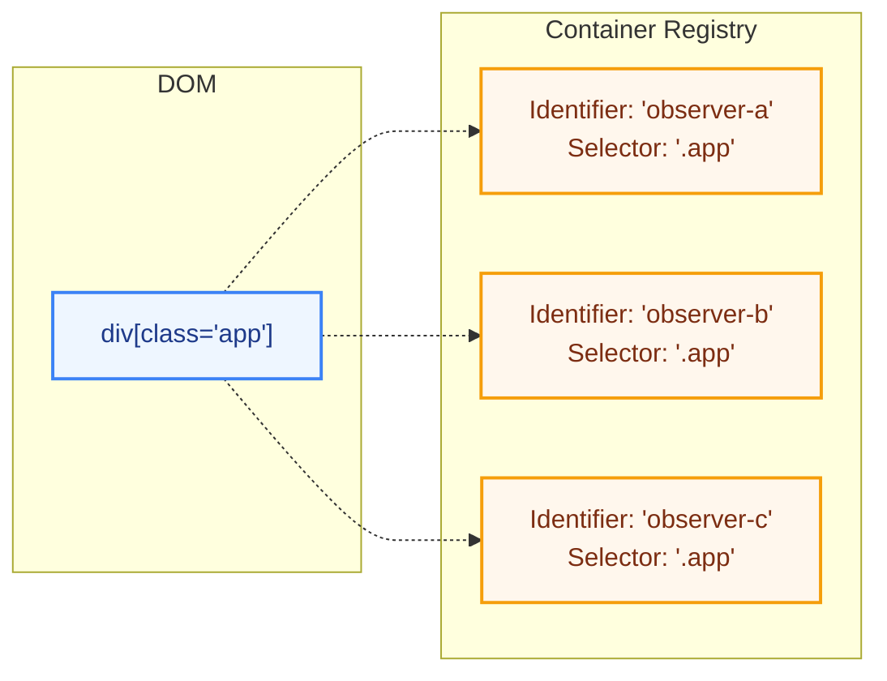
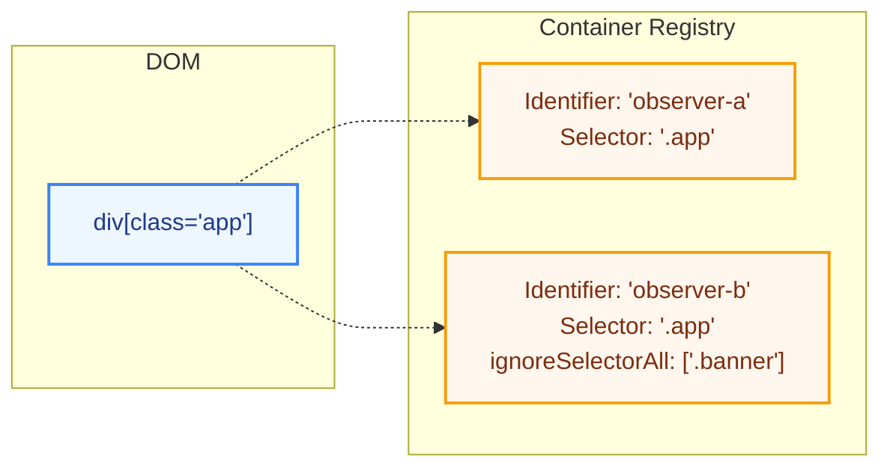

# Container Definitions

With our Container Timing API not only do we need to define which DOM nodes are considered containers, but also what properties (or modes) they should have. This section outlines the structure and attributes of container definitions plus the problems we face with the current design.

The following document assumes we have moved from containertiming-nesting to containertiming-modes which is described [here](https://github.com/bloomberg/container-timing/issues/22#issuecomment-3486196612)

## Structure of Container Definitions (Today)

Today a container is defined like this:

```html
<div containertiming="my-container">
  <!-- div content goes here -->
</div>
```

With a [performanceObserver](https://developer.mozilla.org/en-US/docs/Web/API/PerformanceObserver) setup to listen for container timing entries:

```javascript
const observer = new PerformanceObserver((list) => {
  for (const entry of list.getEntries()) {
    console.log(entry);
  }
});
observer.observe({ type: "container" });
```

If we imagine the relationship between the DOM and the container definition it looks like this:



Containers are global, so there can only be one container per DOM element. This adds limitations when users want to measure the same tree in a different observer.

One scenario is measuring the page with and without ads. In this case we may want to create two observers: one that includes everything, and one that ignores certain ad containers.

Another scenario is multiple component authors who want to measure their own components on the same page but set private or ignore on various nodes, this would influence measurements in other observers.

## Reviewing the model around containers

Instead we could decouple containers and their DOM counterparts by registering containers at the Observer site. This would allow multiple observers to listen to the same DOM element but with different container definitions.



Now that we have decoupled the container definitions from the DOM elements, the next question is how do we register these containers? and _when_ should they be registered?

### _Hypothetical Example_

```html
<div class="app">
  <!-- content -->
</div>
```

```javascript
// Define container for Observer A
const containerDefA = {
  selectorRoot: ".app",
  id: "observer-a",
};

const observerA = new PerformanceObserver((list) => {
  for (const entry of list.getEntries()) {
    console.log("Observer A:", entry);
  }
});

// Define container for Observer B
const containerDefB = {
  selectorRoot: ".app",
  id: "observer-b",
};

const observerB = new PerformanceObserver((list) => {
  for (const entry of list.getEntries()) {
    console.log("Observer B:", entry);
  }
});

observerA.observe({
  type: "container",
  containerDef: containerDefA,
});

observerB.observe({
  type: "container",
  containerDef: containerDefB,
});
```

### Why selectors?

Using selectors allows us to register containers even if the DOM element isn't available yet. This is useful for single page applications or dynamic content where the element may be created after the observer is set up.

The downside to this is that the implementation may need to do more work to "test" DOM nodes against our selector list as they are painted to see if they match any registered containers.

## Challenges with dynamic registering

Registering in this way introduces some challenges:

1. How do we handle nested containers with different modes (private, shadowed, transparent)? These modes don't make as much sense now that containers live in isolation and not in a "global" tree.

2. How does this work with performance? The browser doesn't know ahead-of-time which containers to track, so it may need to add metadata to many elements which could impact memory usage.

3. Does this model introduce too much overhead?

We have some options below on how to proceed with this.

## Options?

### Option 1: Proceed with the above API idea but remove "modes".

If containers run in isolation and don't "nest" each other then modes don't make sense. Private mode isn't needed because each observer can decide what to track or not. There isn't a big enough use case for shadowed mode either, if a user wants to encapsulate timing information to a root they can just use a shadow root as the container (which would still work).

Then there's the question of "ignore". We don't want ignores to have a "global" effect across all observers either. So perhaps we can add ignore as part of the container definition when registering.

The following example below shows a developer wanting to track timings of their site with ads and without. They create 2 observers, one which ignores the ad banner container.



**Pros**:

- Simpler API
- Ignore can still be achieved
- Shadow mode will "just work" for some elements already.
- Identifiers can be set per observer.

**Cons**:

- The browser would need to track every element for timing information as it won't know ahead-of-time which elements we're interested in, this could cause memory issues as every element being painted would need to store more metadata. (need to test)
- The last container timing event you get may differ depending on when you registered, this means results may not be deterministic (even if the page is the same).

### Option 2: Declarative Container Rules

This builds on Option 1 (still no modes) but instead of registering containers dynamically via the observer API, we declare them in a `<script type="containerrules">` block in the HTML. This would solve the performance issue as the renderer would know ahead-of-time which elements to track.

```html
<script type="containerrules">
  {
    containers: [
      {
        "selectorRoot": ".app",
        "id": "observer-a"
      },
      {
        "selectorRoot": ".app",
        "id": "observer-b",
        "ignoreSelectorAll": [".ad-banner"]}
    ]
  }
</script>
```

```javascript
const observer = new PerformanceObserver((list) => {
  $;
  for (const entry of list.getEntries()) {
    console.log(entry);
  }
});
observer.observe({ type: "container", containerId: "outer-container" });
```

**Pros**

- You could use modes with format because they would be set from the beginning.
- Much better memory performance (not adding metadata to elements we don't care about)
- We could even drop entries if there's no corresponding observer for an ID after a certain amount of time

**Cons**:

- You wouldn't be able to register new container rules dynamically (due to the issue above).
- Ignore is global

### Option 3: Keep API attribute-focused (as is)

This would mean keeping everything declared in the attributes instead of anywhere else.

**Pros**

- Simple API just mark the HTML elements with containertiming attributes, alongside some rules you want
- This is performant because the renderer knows the rules when its parsing the element, it doesn't need to "anticipate" which elements are going to need timing data.

**Cons**

- You can't have two or more observers on the same root setting different rules. If someone sets rule private it will be overwritten by someone else setting it to transparent etc
- You can't have two or more different IDs for a container root as it is set directly on the root. A second observer would need to use whichever identifier is set, you can see more of this discussed [here](https://github.com/bloomberg/container-timing/issues/20)
- Limited API which works well for single author, but won't help if components are observed by different users.
- "ignore" is global

## Summary Comparison

The table below compares the three primary approaches (Option 1: Dynamic Registration w/out modes, Option 2: Declarative Rules, Option 3: Attribute-Focused) across common evaluation criteria.

| Criterion                     | Option 1: Dynamic (no modes)                         | Option 2: Declarative (no modes)                          | Option 3: Attribute focused (global containers) |
| ----------------------------- | ---------------------------------------------------- | --------------------------------------------------------- | ----------------------------------------------- |
| API Complexity                | Medium – JS object contracts per observer            | Higher – upfront JSON manifest alongside potential JS api | Low – HTML attributes only                      |
| Dynamic Registration          | Yes (immediate)                                      | Limited (static upfront; could extend)                    | No (must exist before paint)                    |
| Memory Footprint              | Potentially high (must tentatively track every node) | Low (renderer knows targets early)                        | Low (renderer knows targets early)              |
| Determinism / Reproducibility | Low (late registration loses early paints)           | High (we can buffer the right entries)                    | High (we can buffer the right entries)          |
| Multi-Observer Support        | Yes (isolated container defs per observer)           | Yes (isolated container defs per observer)                | No (single global definition per element)       |
| Ignore Granularity            | Per observer via `ignoreSelectorAll`                 | Per observer via `ignoreSelectorAll`                      | Global (shared)                                 |
| Modes (private/shadow/etc.)   | Removed / implicit via encapsulation                 | Removed / could reintroduce deterministically             | Present but conflict-prone                      |
| Initial Paint Coverage        | Risk of missing early paints if registered late      | Full (if in manifest)                                     | Full (if attributes present)                    |
| Implementation Risk           | High: Tracking and recording all paint timings       | Medium-Low (parser + registry)                            | Low (already exists)                            |
| Migration Path                | Requires new observe signature                       | Add manifest which isn't typical for performance APIs     | Status quo (similar to `elementtiming`)         |
