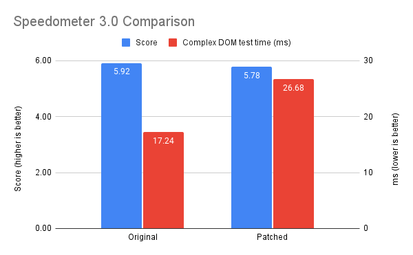
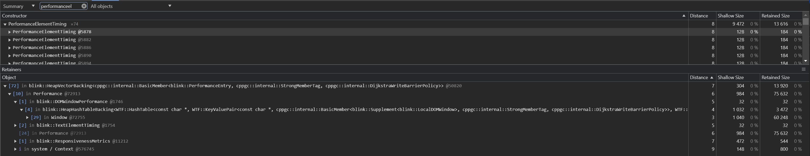

# Performance Impact

Implementing container-timing directly into the user agent could potentially degrade performance, we would want to know by how much before rolling out such a feature. This report does not test the javaScript polyfill, but the act of tracking and adding instrumentation/observation of many elements.

The tests here simulate `elementtiming` tracking on all [applicable elements](https://developer.mozilla.org/en-US/docs/Web/API/PerformanceElementTiming#description) (similar to how the polyfill works) to see what the performance impact would be. We filter down to only elements in the viewport when the application has loaded (which matches up with how paint timing works today).

### Methodology

In order to see the impact of observing many elements in the browser I am going to remove the checks (for the `elementtiming` attribute). This should mean that no annotation is needed and all applicable element are observed.

To do this I am comparing a main build of Chromium, commit: [dcfd76bb7e1097a828af8d8db2add512bf3403a3](https://github.com/chromium/chromium/commits/dcfd76bb7e1097a828af8d8db2add512bf3403a3) with a patch, you can see the patch changes below:

```diff
diff --git a/third_party/blink/renderer/core/paint/timing/image_element_timing.cc b/third_party/blink/renderer/core/paint/timing/image_element_timing.cc
index e60d0d5d9255c..3ab8e431c70a4 100644
--- a/third_party/blink/renderer/core/paint/timing/image_element_timing.cc
+++ b/third_party/blink/renderer/core/paint/timing/image_element_timing.cc
@@ -35,7 +35,7 @@ IsExplicitlyRegisteredForTiming(const LayoutObject& layout_object) {
   // generate timing entries for the element. See
   // https://wicg.github.io/element-timing/#sec-modifications-DOM for report
   // vs. ignore criteria.
-  return element->FastHasAttribute(html_names::kElementtimingAttr);
+  return true;
 }

 }  // namespace internal
diff --git a/third_party/blink/renderer/core/paint/timing/text_element_timing.cc b/third_party/blink/renderer/core/paint/timing/text_element_timing.cc
index 8709b73c915ab..cab29d3588a8c 100644
--- a/third_party/blink/renderer/core/paint/timing/text_element_timing.cc
+++ b/third_party/blink/renderer/core/paint/timing/text_element_timing.cc
@@ -66,8 +66,6 @@ void TextElementTiming::OnTextObjectPainted(const TextRecord& record) {
   DCHECK(node->IsElementNode());
   auto* element = To<Element>(node);
   const AtomicString& id = element->GetIdAttribute();
-  if (!element->FastHasAttribute(html_names::kElementtimingAttr))
-    return;

   DEFINE_STATIC_LOCAL(const AtomicString, kTextPaint, ("text-paint"));
   performance_->AddElementTiming(
```

### About the changes

This change removes 2 checks:

1. We remove the check for any images that could be registered for element timing and just return true in [image_element_timing.cc](https://source.chromium.org/chromium/chromium/src/+/main:third_party/blink/renderer/core/paint/timing/image_element_timing.cc;l=29-39?q=image_element_timing.cc&ss=chromium%2Fchromium%2Fsrc). All images in the viewport are now registered for instrumentation and observation.
2. Similar to images we remove the check for any text elements and just add all text elements (within the viewport) for instrumentation and observation

Currently, element timing only observes images and text elements so these auto-opt-ins should be enough.

### Machine

The tests are ran on a machine with a 13th Gen Intel(R) Core(TM) i9-13900H, 2.60 GHz and 64.0 GB RAM.

### Testing

From a memory or performance perspective this change is small, so I want to choose websites which are fairly static and don't offer too much variance when refreshing or loading at different times.

With each Chromium build I will:

- Open the performance panel in developer tools
- reload the page and start to record a profile.
- I will then wait 5 seconds or until the profiling is deemed finished (whichever one happens first)
- I will collect some user-visible indicators such as FCP and LCP
- I will then go over to the Memory tab, run garbage collection then take a snapshot from there
- For memory I will collect the shallow size of PerformanceElementTiming elements, how many objects there are and the total size.
- Each run will leave me with a memory snapshot and a performance snapshot.

## Results

### uk.yahoo.com

| Performance |          |          |                  |                  |
| ----------- | -------- | -------- | ---------------- | ---------------- |
| Run         | LCP (ms) | FCP (ms) | LCP patched (ms) | FCP patched (ms) |
| 1           | 676.00   | 676.00   | 865.68           | 865.68           |
| 2           | 981.90   | 1007     | 918.16           | 918.16           |
| 3           | 955.31   | 838.59   | 843.57           | 843.57           |
| Avg         | 871.07   | 840.53   | 875.80           | 875.80           |

| Memory |                         |                                |                 |                               |                                      |                       |
| ------ | ----------------------- | ------------------------------ | --------------- | ----------------------------- | ------------------------------------ | --------------------- |
| Run    | No. PerfElemTiming Objs | Size. PerfElemTiming Objs (KB) | Total Size (MB) | No. PerfElemTiming Objs patch | Size. PerfElemTiming Objs (KB) patch | Total Size (MB) patch |
| 1      | 0.00                    | 0.00                           | 27.9            | 90                            | 11.5                                 | 28.8                  |
| 2      | 0.00                    | 0.00                           | 18              | 89                            | 11.3                                 | 24.3                  |
| 3      | 0.00                    | 0.00                           | 18.2            | 89                            | 11.3                                 | 24.2                  |
| Avg    | 0.00                    | 0.00                           | 21.37           | 89.33                         | 11.37                                | 25.77                 |

### en.wikipedia.org

| Performance |          |          |                  |                  |
| ----------- | -------- | -------- | ---------------- | ---------------- |
| Run         | LCP (ms) | FCP (ms) | LCP patched (ms) | FCP patched (ms) |
| 1           | 828.29   | 828.29   | 285.94           | 235.93           |
| 2           | 343.25   | 343.25   | 372.38           | 372.38           |
| 3           | 339.49   | 233.01   | 321.87           | 321.87           |
| Avg         | 503.68   | 468.18   | 326.73           | 310.06           |

| Memory |                         |                                |                 |                               |                                      |                       |
| ------ | ----------------------- | ------------------------------ | --------------- | ----------------------------- | ------------------------------------ | --------------------- |
| Run    | No. PerfElemTiming Objs | Size. PerfElemTiming Objs (KB) | Total Size (MB) | No. PerfElemTiming Objs patch | Size. PerfElemTiming Objs (KB) patch | Total Size (MB) patch |
| 1      | 0.00                    | 0.00                           | 5.7             | 75                            | 9.6                                  | 5.7                   |
| 2      | 0.00                    | 0.00                           | 5.7             | 75                            | 9.6                                  | 5.7                   |
| 3      | 0.00                    | 0.00                           | 5.7             | 75                            | 9.6                                  | 5.7                   |
| Avg    | 0.00                    | 0.00                           | 5.70            | 75.00                         | 9.60                                 | 5.70                  |

### bbc.co.uk/news

| Performance |          |          |                  |                  |
| ----------- | -------- | -------- | ---------------- | ---------------- |
| Run         | LCP (ms) | FCP (ms) | LCP patched (ms) | FCP patched (ms) |
| 1           | 235.80   | 235.80   | 240.75           | 240.75           |
| 2           | 244.33   | 244.33   | 538.21           | 421.82           |
| 3           | 235.16   | 235.16   | 230.39           | 230.39           |
| Avg         | 238.43   | 238.43   | 336.45           | 297.65           |

| Memory |                         |                                |                 |                               |                                      |                       |
| ------ | ----------------------- | ------------------------------ | --------------- | ----------------------------- | ------------------------------------ | --------------------- |
| Run    | No. PerfElemTiming Objs | Size. PerfElemTiming Objs (KB) | Total Size (MB) | No. PerfElemTiming Objs patch | Size. PerfElemTiming Objs (KB) patch | Total Size (MB) patch |
| 1      | 0.00                    | 0.00                           | 24.7            | 97                            | 12.4                                 | 24.9                  |
| 2      | 0.00                    | 0.00                           | 24.8            | 97                            | 12.4                                 | 24.8                  |
| 3      | 0.00                    | 0.00                           | 24.8            | 97                            | 12.4                                 | 24.8                  |
| Avg    | 0.00                    | 0.00                           | 24.77           | 97.00                         | 12.40                                | 24.83                 |

## Testing in speedometer 3.0

### Methodology

For the same two builds mentioned in [methodology](#methodology) above, I run each build on Speedometer 3.0:

1. Opening up https://browserbench.org/Speedometer3.0/
1. Making nothing else is running on this machine
1. Setting the browser to full screen (to ensure process priority)
1. Clicking "Start Test"
1. Collecting the results
1. Throwing away the first result to remove some noise

We will also keep an eye on the [TodoMVC React Complex DOM](https://github.com/WebKit/Speedometer/blob/release/3.0/resources/todomvc/big-dom-generator/README.md) test as this generates ~6000 elements which should be a big enough number for us to see any differences. These elements are in the viewport so should has instrumentation and be observed.

#### Score (higher is better)

| Run | Original | Patched |
| --- | -------- | ------- |
| 1   | 5.92     | 5.84    |
| 2   | 5.91     | 5.79    |
| 3   | 5.93     | 5.7     |
| Avg | 5.92     | 5.78    |

#### React Complex DOM test (Lower is better)

| Run | Original (ms) | Patched (ms) |
| --- | ------------- | ------------ |
| 1   | 17.22         | 22.86        |
| 2   | 17.27         | 28.21        |
| 3   | 28.98         | 17.24        |
| Avg | 21.16         | 22.77        |



## Conclusion

For page loads the performance results vary more than the memory results, this is expected. Any variance in the network will cause numbers to skew, but memory would still be the same, for this reason I've focused more on memory than I have performance.

Looking at the memory profiles from each run we can see their is very little impact, wikipedia for example which is fairly static has no change in total size, and an increase in 9.6kb.

For speedometer tests we see a bit more consistency between the two builds, the patched build is slower by less than a millisecond averaged across 3 tests and the score is also lower so this is expected but by a small fraction, this is expected as there will still be overhead generating and storing the PerformanceElementTiming objects.

The reason for little impact is because of the [implicit registration](https://github.com/w3ctag/design-reviews/issues/326#issuecomment-494947186) these elements need to go through regardless of whether they're tagged or not. If the text or image element is within the viewport it will be registered for instrumentation ahead of time because of PerformanceObserver buffered results. The only difference the attribute makes is the observability from the Performance object.

### Performance Element Timing objects are retained



Despite these `PerformanceElementTiming` Objects not being referenced they will still exist in the heap.

Each performance entry once created [gets saved](https://source.chromium.org/chromium/chromium/src/+/main:third_party/blink/renderer/core/timing/window_performance.cc;l=764;drc=6f3ea2d7a959af499951279877a3f3e68c7fdc31) into a [buffer](https://source.chromium.org/chromium/chromium/src/+/main:third_party/blink/renderer/core/timing/performance.cc;l=785;drc=6f3ea2d7a959af499951279877a3f3e68c7fdc31?q=performance.cc&ss=chromium%2Fchromium%2Fsrc).

Future observers may want to know about these elements so they are kept in a buffer and this is expected, the C++ Performance object keeps a reference to the buffer and tracks that reference via a [visitor::Trace()](https://chromium.googlesource.com/chromium/src/+/08bac9d4c75f023df86a07be1986884f760dab94/third_party/blink/renderer/core/timing/performance.cc#1340) command. This is why we see the link on the heap snapshot in the image above.

Chromium uses Oilpan for its garbage collection, more info here:

https://chromium.googlesource.com/v8/v8/+/main/include/cppgc/README.md
