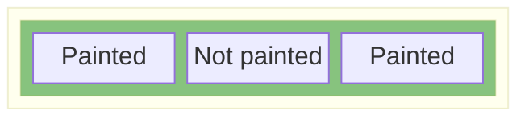
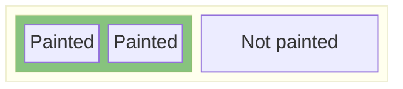

# Element Timing For Containers Polyfill

This polyfill allows developers to support element timing on containers (like `div`s or `section`s). This will fill a limitation which element-timing is [currently unable](https://github.com/WICG/element-timing/issues/79) to do. If you're working on a component and need better heuristics of when that component has been painted you can tag it with attributes and receive events similar to [`element-timing`](https://developer.mozilla.org/en-US/docs/Web/API/PerformanceElementTiming).

## How to use

This polyfill should be loaded in the head or as early as possible so it can annotate elements needed for timing when the observer runs. At the very latest it should be loaded before you make the call to initiate the observer.

Add this polyfill to the top your page then use the `PerformanceObserver` to mark entries. From this point you can use the `PerformanceObserver` as you normally would. This polyfill will intercept calls from the observer and include any containers you wish to keep track off. You will also need to mark containers you're interested in tracking with the `containertiming` attribute (See [update below](#update-22022024)), just like you would on individual elements. See the example below:

**Markup**

```html
<div containertiming>...some content</div>
```

**JS**

```js
const myObserver = new PerformanceObserver((list) => {
  list.getEntries().forEach((entry) => {
    console.log(entry);
    /**
    {
        "size": 64659.1ss373996414,
        "identifier": "wrapper",
        "lastPaintedSubElement": {},
        "largestContentfulPaint": {
            "size": 64659.117373996414,
            "element": {}
        },
        "firstContentfulPaint": {
            "renderTime": 5062.0999999996275,
            "element": {}
        },
        "startTime": 5062.0999999996275,
        "visuallyCompletePaint": {
            "renderTime": 5062.0999999996275,
            "lastPaintedSubElement": {}
        }
    }
    **/
  });
}, "newAreaPainted" | "aggregatedPaints"); // "aggregatedPaints by default"

observer.observe();
```

## Entry Interface

The returned objects will take the following shape

- `size` - The size of the painted rectangle within this container returned as the area (width \* height). This is achieved by adding together all the non-overlapping painted elements.
- `identifier` - A string which is the value of the containertiming attribute on the element.
- `lastPaintedSubElement` - This is the last element to be painted within this container ("aggregatePaint" mode only)
- `largestContentfulPaint`
  - `size` - The size of the candidate element which is the largest within this container
  - `element` - A reference to the candidate element itself
- `firstContentfulPaint`
  - `renderTime` - The time this element was painted
  - `element` - A reference to the element first painted in this container
- `startTime` - Time of the first paint in this container
- `visuallyCompletePaint`
  - `renderTime` - The time of the last non-overlapping element to paint
  - `lastPaintedSubElement` - A reference to the last painted element within this container

## Examples

You can open the HTML of each example and look in the dev tools console to see what the event looks like.

- [Table Example](./examples/table/table.html)
- [DOM Updates Example](./examples/adding-content/index.html)
- [Shadow DOM](./examples/shadow-dom/index.html)
- [SVG](./examples/svg/index.html)

## newAreaPainted and aggregatedPaints

There are 2 modes you can use this polyfill in, `newAreaPainted` and `aggregatedPaints`.

### `aggregatedPaints`

This mode will collect a union of paints into a single rectangle and return that as the `intersectionRect`. Thus the intersectionRect value is the "smallest rectangle covering the sub elements painted".
This is useful if you want to know how much of your container has painted, the cons with this mode are that it may cover an area which hasn't fully been painted yet if there's been content painted either side of it.



If the browser paints content from one area to another (such as text on the left and an image on the right) then it would be fine.



### `newAreaPainted`

This mode fires when there's been paints in new areas, this is similar to the previous mode (as elements only fire element-timing events once), except 2 differences:

1. Even if an element is removed from the DOM and replaced with another element, if it paints in an area already painted that would not trigger a new observer event to fire.
2. This does not return an aggregated rectangle of paints like the above but instead fires when there's been a paint in a new area

## Nested Containers

You have the ability to nest containers within one another, entries for each container will still be emitted, for filtering on the container you're interested in its best to use an identifier when setting the attribute, such as `containertiming="myContainer"`.

There are various strategies for how we deal with nested containers, ignoring by default.

### `ignore`

This will treat both containers in isolation and won't pass up any entry information from one container to a parent. Anything which happens to a sub-container is ignored by the parent.
This can be useful if the inner container is unrelated to your content and you don't want to track any rendering behavior from it at all.

### `transparent`

This is similar to ignore above, but will still account for any changes happening in the inner-container, as though the boundary never existed in the first place. From the perspective the inner-container attribute has no effect.
The inner container will continue to receive its events like normal

## Debug Mode

You can set a global `ctDebug` flag to true in order to see paint rectangles from the collection of paints when a container has updated.
(set `window.ctDebug` or `globalThis.ctDebug` to true)

## Performance Impact of a native implementation

See [Performance Impact](./performance-impact.md)

## FAQs

### Why can't we just use the `elementtiming` attribute on containers like divs?

Due to some applications rendering containers before the contents within that container, its impossible to know the difference between a single element and a container holding no elements when this plugin starts. We tried using `[elementtiming]:has(*)` but because some applications start with their containers empty e.g:

```html
<div class="container" elementtiming>
  <!-- Some stuff will be injected here -->
</div>
```

The polyfill won't be able to identify these. So instead we opted to have a separate attribute to aid in finding containers; `containertiming`.

### Should the user know how much has painted?

When we get paint events for a container its difficult to know if its fully rendered or not. In our
polyfill we will fire multiple times for each new paint happening in a
container.

Just like LCP developers can choose the most recent candidate as
their paint time. That being said, this polyfill does provide a
"lastPaintedElement" field which lets developers track which element caused the
last paint update.

### Should we stop observing on interaction?

Due to the nature of containers having multiple events (unlike single element), we may want
to stop observing once there's interaction so we have the concept of a "final
candidate". This would let developers know the renderTime of the last paint
after the page has loaded.

### Should this polyfill support additional elements?

There will be new performance entries when there's DOM mutation happening within
a container, such as addition of new children. The observer currently fires new
entries when this happens if they have caused new paint events.
